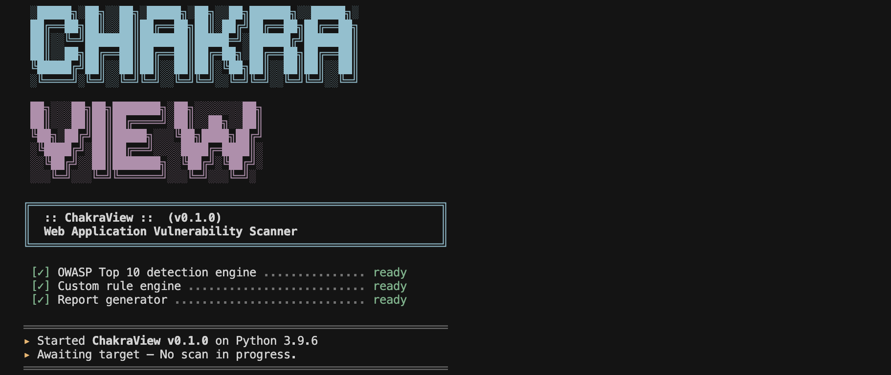

<div align="center">
  
  <h1>ChakraView</h1>
  <p><strong>The ultimate Vibe Auditing Tool for modern web applications.</strong></p>

  <p>
    <a href="#-getting-started"></a>
    
    
  </p>
</div>

---

ChakraView is the ultimate CLI-based **Vibe Auditing Tool** built to help **vibe coders** protect their vibe-coded applications. As AI models grow stronger, the threat from **vibe hackers** is increasing exponentially across the web. It audits your app's security vibe and delivers actionable insights with practical remediation guidance ensuring your code stays safe from bad vibes.

> 🔨 **This project is being built in public.** Architecture decisions, progress, and the roadmap are all shared openly. Star the repo to follow along!

## ✨ Features *(Planned)*

| Feature | Description |
|---|---|
| 🔍 **OWASP Top 10 Detection** | Comprehensive scanning for the most critical web application vulnerabilities |
| ⚙️ **Custom Rule Engine** | Define and run your own tailored vulnerability detection rules |
| 📊 **Actionable Reports** | Detailed scan results with severity ratings and remediation steps |
| 💻 **CLI-First Interface** | Built for developers — rich, intuitive terminal output |
| 🧩 **Plugin Architecture** | Extensible system to add new scanners and integrations seamlessly |

## 🖥️ Preview

<div align="center">
  
</div>

## 🏁 Getting Started

### Prerequisites

- **Python 3.10** or higher

### Installation & Usage

```bash
# Clone the repository
git clone https://github.com/prasunchakra/ChakraView.git
cd ChakraView

# Run the scanner
python main.py
```

## 🤝 Contributing

ChakraView is fully open-source. Feedback, feature requests, and contributions are welcome!  
Formal contribution guidelines are coming soon.

## 📬 Contact

Built by [**Prasun Chakraborty**](https://github.com/prasunchakra). Reach out via GitHub for questions or collaboration.
